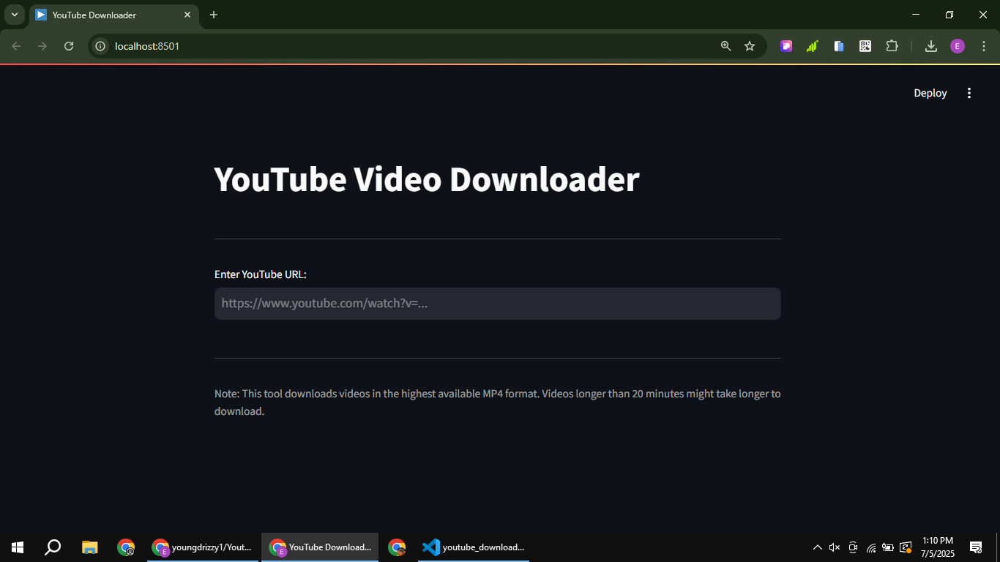
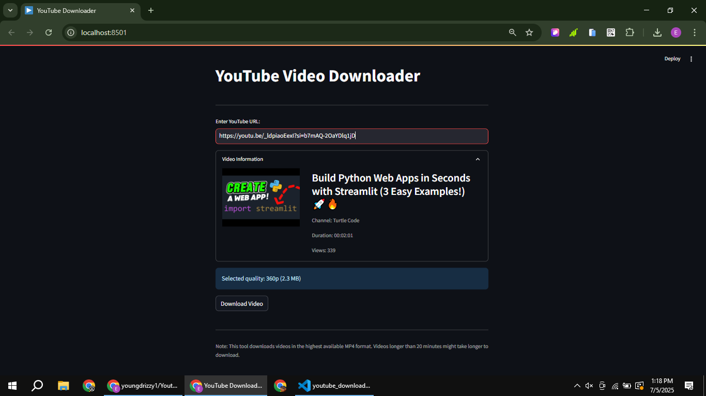

# 📹 YouTube Video Downloader

[](https://youtube-downloader0.streamlit.app/)
[](https://www.linkedin.com/posts/eromosele-itoya_python-streamlit-youtubedownloader-activity-7347256583044685824-1nci?utm_source=share&utm_medium=member_desktop&rcm=ACoAAEbDOGsBGINDr5uoWo3fkmNHZc_HI1Qst6k)

A slick and interactive YouTube Video Downloader built with Python and Streamlit. Pop in a YouTube URL, check out the video details, and download it in MP4 format with ease!

## Features ✨
- 📥 Download YouTube videos in the highest available MP4 quality
- 📺 Display video details: thumbnail, title, channel, duration, and views
- ⏳ Real-time progress bar for downloads
- 💾 Save videos to your device with a single click
- 🛠️ Clear download option to reset and go again
- 📱 Responsive design for all screens

## Screenshots 📸
|  Initial Screen | Video Details   | Download Complete |
|------------------|----------------|-------------------|
|  |  |  |

## How to Play 🎮
1. Roll the dice to accumulate points
2. Hold to bank your points and end your turn
3. Avoid rolling a 1 or you lose your turn points
4. First to reach 100 points wins!
5. Computer plays strategically - stops at 20+ points per turn

## Tech Stack 🛠️
- **Frontend**: Streamlit
- **Backend**: Python 3
- **Key Modules**: 
  - `streamlit` for UI
  - `random` for dice rolls
  - `time` for turn simulation

## Installation ⚙️
1. Clone repository:
```bash
git clone https://github.com/youngdrizzy1/Pig-Game
cd Pig-Game
```

2. Install dependencies:
```bash
pip install streamlit
```

3. Run the application:
```bash
streamlit run app.py
```

## Live Demo 🌐
Try the live version: [Pig-Game-App](https://pig-game.streamlit.app/)

## Connect with Me 👋
[LinkedIn](https://www.linkedin.com/in/eromosele-itoya/) | 
[GitHub](https://github.com/youngdrizzy1)
