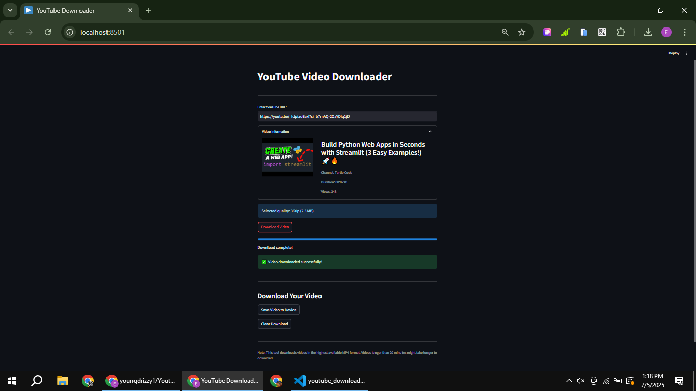

# 📹 YouTube Video Downloader

[](https://youtube-downloader0.streamlit.app/)
[](https://www.linkedin.com/posts/eromosele-itoya_python-streamlit-youtubedownloader-activity-7347256583044685824-1nci?utm_source=share&utm_medium=member_desktop&rcm=ACoAAEbDOGsBGINDr5uoWo3fkmNHZc_HI1Qst6k)

A slick and interactive YouTube Video Downloader built with Python and Streamlit. Pop in a YouTube URL, check out the video details, and download it in MP4 format with ease!

## Features ✨
- 📥 Download YouTube videos in the highest available MP4 quality
- 📺 Display video details: thumbnail, title, channel, duration, and views
- ⏳ Real-time progress bar for downloads
- 💾 Save videos to your device with a single click
- 🛠️ Clear download option to reset and go again
- 📱 Responsive design for all screens

## Screenshots 📸
|  Initial Screen | Video Details   | Download Complete |
|------------------|----------------|-------------------|
|  |  |  |

- Initial Screen: Start here by entering a YouTube URL.
- Video Details: See the thumbnail, title, and stats before downloading.
- Download Complete: Progress bar full, ready to save or clear!

## How to Use 🎥
1. Enter a valid YouTube URL in the input field.
2. Check out the video details (thumbnail, title, channel, etc.).
3. Hit "Download Video" and watch the progress bar roll.
4. Once done, click "Save Video to Device" to grab the file.
5. Use "Clear Download" to reset for the next video.
Note: Videos over 20 minutes might take a bit longer to download.

## Tech Stack 🛠️
- **Frontend**: Streamlit
- **Backend**: Python 3
- **Key Libraries**: 
  - `streamlit` for the UI
  - `pytubefix` for YouTube video downloading
  - `io.BytesIO`  for file buffering
  - `time`   for duration formatting

## Installation ⚙️
1. Clone repository:
```bash
git clone https://github.com/youngdrizzy1/Youtube-Downloader
cd Youtube-Downloader
```

2. Install dependencies:
```bash
pip install streamlit pytubefix
```

3. Run the application:
```bash
streamlit run app.py
```

## Live Demo 🌐
Check out the live version: [Youtube-Downloader-App](https://youtube-downloader0.streamlit.app/)
- Heads Up: The app works perfectly locally but may hit errors on Streamlit Cloud due to pytubefix or cloud restrictions. I’m on it—suggestions welcome!

## Known Issues ⚠️
Runs smoothly on local devices but faces deployment hiccups on Streamlit Cloud. Likely a pytubefix compatibility or network issue—help appreciated!

## Connect with Me 👋
[LinkedIn](https://www.linkedin.com/in/eromosele-itoya/) | 
[GitHub](https://github.com/youngdrizzy1)
